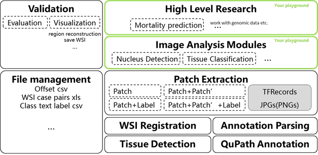

# WSITools
Tools for whole slide image (WSI) processing
## Quick Start
### Installation
```bash
git clone https://github.com/smujiang/WSITools.git
cd WSITools
python setup.py install
```
### Testing


## Descriptions

## Architectures

## Documents
[Annotate with QuPath and Export Annotations](docs/wsi_annotation/QuPath_scripts/readme.md)   
[Tissue Detection](docs/tissue_detection/tissue_detector.md)   
[WSI Aligment](docs/wsi_registration/wsi_registration.md)    
[Patch Extraction](docs/patch_extraction/patch_extraction.md)     
[Pairwise Patch Extraction](docs/patch_extraction/pairwise_patch_extraction.md)

