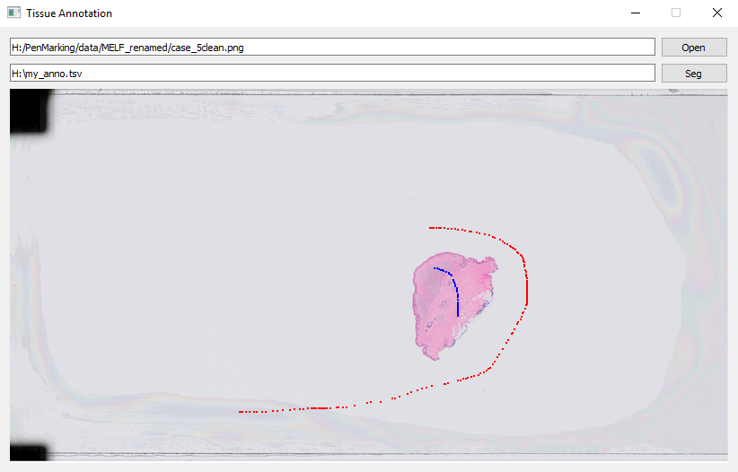

Tissue detection is necessary for WSI analysis, because expansive areas of WSI are blank.
Tissue detector can help us save time for patch extraction and model training.

Currently we provide two options for tissue detection. 1. Threshold; 2. Gaussian Naive Bayes (GNB) Model.
1) Threshold method just convert RGB color image into LAB space, and do threshold.
2) GNB need to annotate some pixel points to train the model, and use the trained model to predict which pixels are tissue in a certain of downscaled WSI.  
[The annotation tool](../../wsitools/tissue_detection/pixel_sampling_tool) can track left and right key of mouse to sample the pixel values of foreground (Blue) and background (Red), and save the values into a tsv file.

