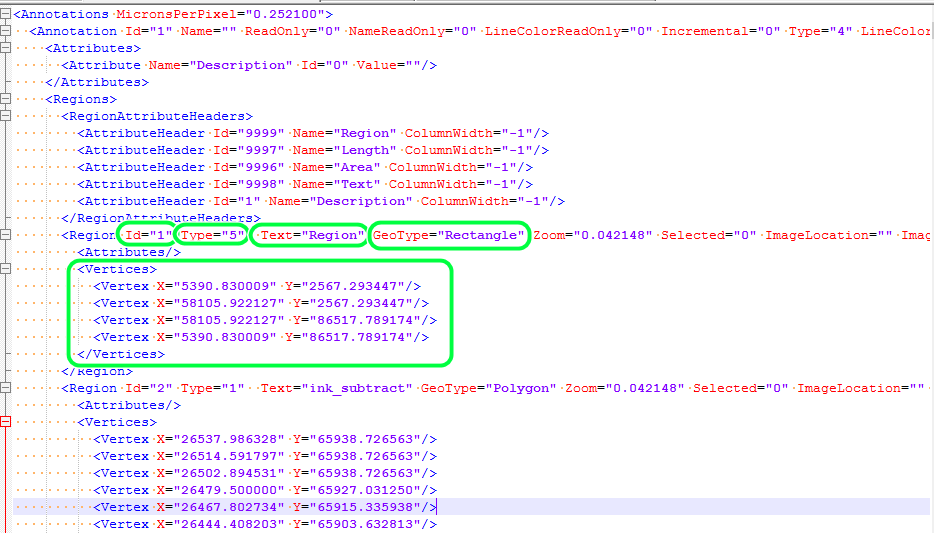
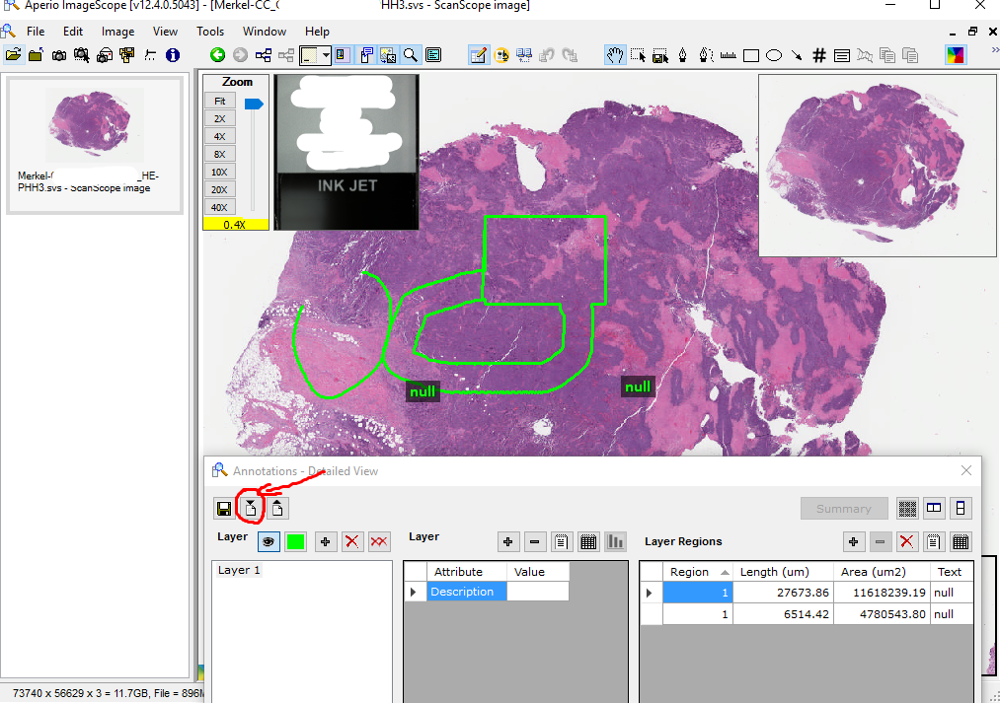
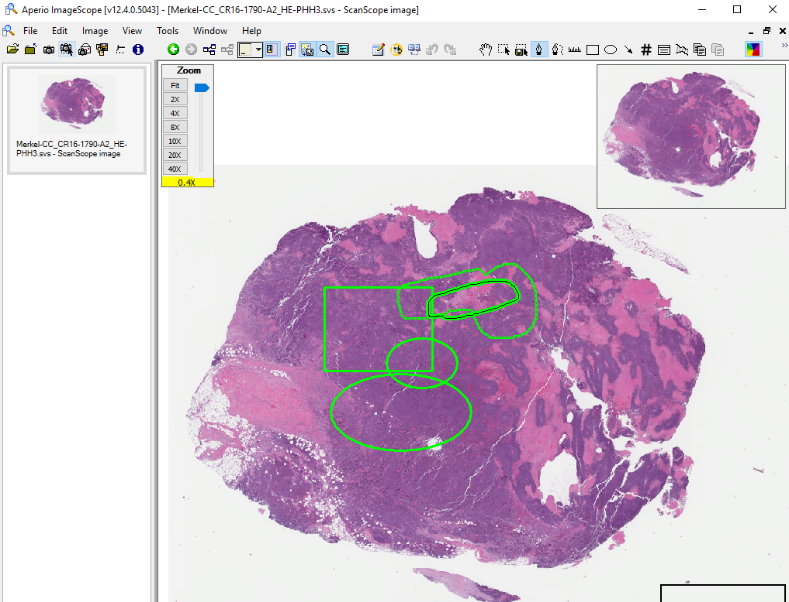
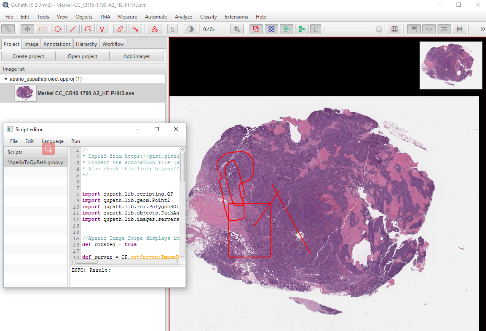

# Annotate with QuPath and Export Annotations
## 1. Annotate with QuPath
### 1.1 Annotate Regions

### 1.2 Annotate Offset (Points)
 
## 2. Export Annotations
### 2.1 Export regions to TCGA xml format
The code for annotation export is located at [export_anno_tcga_xml.groovy](../../../src/wsi_annotation/QuPath_scripts/export_anno_tcga_xml.groovy)

In order to get annotations, you need to follow these steps:
1. Download the code to local computer, and modify the variable “root_dir” in the code to specify where you would like to save your annotation;
2. Open your QuPath annotation project;
3. In QuPath menu bar, click Automate->Shared scripts->Open script directory, navigate to the code you downloaded, open the code there will pop a code running window.
4. Click Run, you can get the annotations in your “root_dir”.

Note: If any package in the code is missing, it will throw errors. QuPath is developed with Groovy, like Java, all the packages are .jar files. You need to **find the right jar and drag** the missing jar onto the QuPath window, and you just need to do this only once. This step copies the jar into QuPath's jar directory. 

  
Figure 2.1 An example of an annotation project and annotation export UI. After opening the code in QuPath annotation project, click run to export the annotation result.

  
Figure 2.2. output files of annotations

As shown in Figure 2.2, the outputs of this code are two types of files: One is the label-id.csv, it’s a table shows the correspondence of label text and label ID, as below in Figure2.3.

  
Figure 2.3.  An example of label text and ID tabel

The others are annotations exported from QuPath, and each xml file has the same file name(uuid) with the annotated WSI except file extension. For example, if the annotation is extracted from “0afe6b9fe2d2468e9c5754024757c92f.tiff” the corresponding annotation is saved in “0afe6b9fe2d2468e9c5754024757c92f.xml”.

The annotation xml file meets the requirements of TCGA format. As shown in Figure 2.4, all the annotation points are all saved in <vertices> node.

  
Figure 2.4.  An example of annotation file. The green rectangles show the meaningful parts for patch extraction. According to Naresh’s statements, he used only region “Id” and region “Type”  to identify the labels for each annotation(region).

### 2.2  Export regions to binary mask
The code for this annotation export is located at [export_anno_binary_jpgs.groovy](../../../src/wsi_annotation/QuPath_scripts/export_anno_binary_jpgs.groovy)


### 2.3 Export offset/points annotation to xml 
see functions ```get_xml_offset_barycentric``` and ```get_affine_matrix``` in [offset_annotation.py](../../../src/wsi_annotation/offset_annotation.py)


### 2.4 Export offset/points annotation to zip
see function ```get_QuPath_offset_barycentric``` in [offset_annotation.py](../../../src/wsi_annotation/offset_annotation.py)

## 3. Work with Aperio Image Scope
### 3.1 From QuPath to Aperio
Aperio Image Scope(a whole slide image viewer) can also provide annotations in this xml format, which means the xml may also be able to be import to Aperio. And Aperio may also be able to a annotation tool for our project.

According to our testing, the export annotation can also be imported into Aperio Image Scope (Note that Aperio may not open your image). Be aware that the annotations may seem different geometrically. For example, the curve is annotated in QuPath, and its closed. But when we import the xml annotation from QuPath to Aperio, the curve is open.
  
  
How to import the xml generated by the code to Aperio?
click View->Annotations, and then import the xml to Aperio.

### 3.2 From Aperio to QuPath
It might also be able to convert Aperio annotation so as to import the converted file to QuPath. Please refer to [AperioToQuPath.groovy](../../../src/wsi_annotation/QuPath_scripts/AperioToQuPath.groovy)

The code is copied from https://gist.github.com/DanaCase/9cfc23912fee48e437af03f97763d78e. It can convert the annotation file (xml files) from Aperio Image Scope, so that the annotation can be loaded into QuPath. You can also check this link to get more information: https://groups.google.com/forum/#!searchin/qupath-users/import$20annotation%7Csort:date/qupath-users/xhCx_nhbWQQ/0kW38lEXCAAJ

It also has some problems on parsing some shapes (That’s might because the shape attribute from Aperio can’t be recognized by QuPath), and also the x, y coordinate is reversed.
  
 
