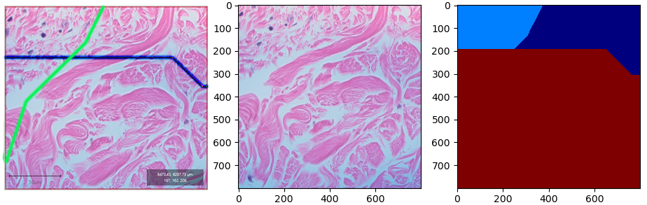

We divide annotations into two types, one is points, the other is regions.
##  Points Annotation
> We can use the annotated points to locate target cells, aimed at training a cell detection model; 

> We can annotate the same cell in a pair of WSI, so the image transformation can be calculated.


## Region Annotation
Currently we support Polygon, Rectangle, and Area tool in QuPath. 

The export annotation can be validate with function ```validate_annotation``` in class ```AnnotationRegions```
A figure like the right two subplot of the figure below will be created.

The left subfigure is the screen cut from QuPath, it shows the parsed annotation is the same as in QuPath.
Because we defined the priority of different regions, so some overlay area just show one annotation.
The priority of the annotated regions is defined in the case_uuid.xml and class_label_id.csv 

 


