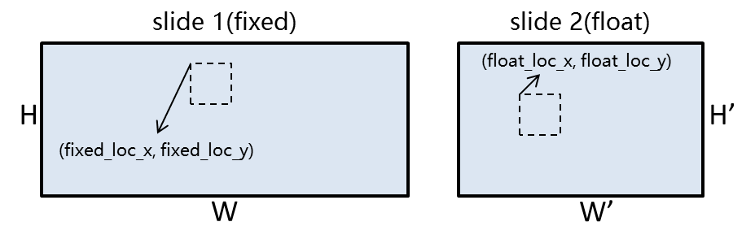
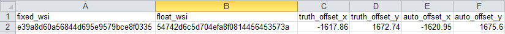

### Work with single WSI

Example code snippet
```python
# get WSI width and hight
W, H = openslide.open_slide(wsi_fn).dimensions

# read patch from a location
patch = openslide_obj.read_region((x, y), level, patch_size)

# get the foreground indices from binary mask.
# Be aware! Indices were returned in (row, column) order, so we use (loc_y, loc_x) here.
(loc_y, loc_x) = np.where(wsi_tissue_mask > 0)  
patch = wsi_obj.read_region((loc_x[idx], loc_y[idx]), 0, patch_size)

# plot foreground indices
import matplotlib.pyplot as plt
for idx, lx in enumerate(loc_x):
    plt.figure(1)
    plt.plot(loc_x, loc_y, 'r.')
    plt.plot(loc_x[idx], loc_y[idx], 'go')
    plt.gca().invert_yaxis()
    plt.show()
```

### Work with a pair of whole slide image

Example code snippet
```python
pos_indices = np.where(wsi_tissue_mask > 0) 
fixed_loc_x = (np.array(pos_indices[1]) * rescale_factor).astype(np.int)
fixed_loc_y = (np.array(pos_indices[0]) * rescale_factor).astype(np.int)
float_loc_x = (np.array(pos_indices[1]) * rescale_factor + offset[0]).astype(np.int)
float_loc_y = (np.array(pos_indices[0]) * rescale_factor + offset[1]).astype(np.int)
```
```rescale_factor``` is the divisor to get the downscaled image for tissue/foreground detection. ```offset``` is the offset load from a csv file. The content of this csv file likes below:

Which is managed by ```OffsetCSVManager```
